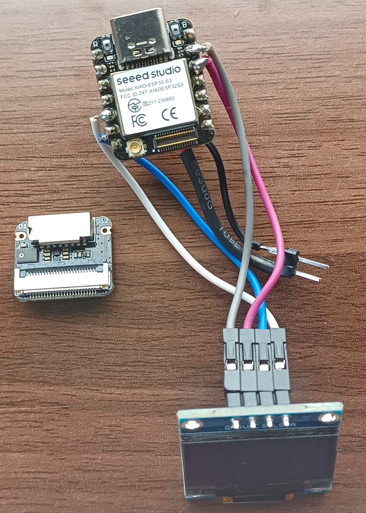
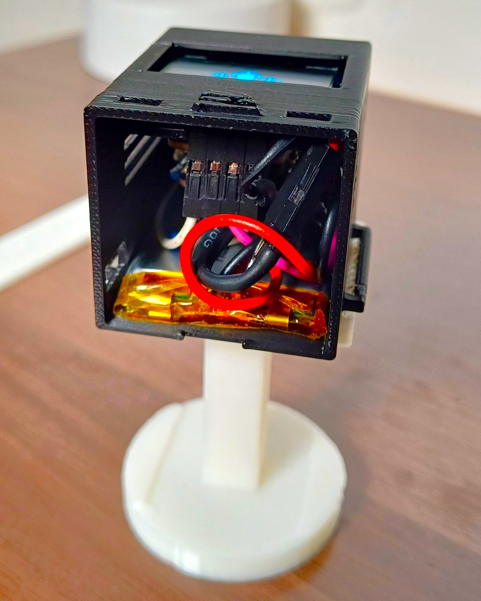

# TinyML wearable for environmental sensing :ear:

This project includes Arduino codes and library for TinyML project that can detect dog sounds in the environment; specifically dog barking and dog howling sounds. The Machine Learning model was developed using Generative AI dataset created by [ElevenLabs synthetic data integration](https://www.edgeimpulse.com/blog/create-sound-datasets-generative-ai/) on the [Edge Impulse](https://edgeimpulse.com/) platform. The model is then deployed on the XIAO ESP32S3 development board.

You can find the public Edge Impulse project here: [Generative AI powering dog sound classification](https://studio.edgeimpulse.com/public/497492/latest). To add this project into your account projects, click “Clone this project” at the top of the window. Please read up on the project's documentation on [Edge Impulse's page]() to help you get started on your own creation.

The [Arduino code](Xiao_ESP32S3_EI_dog_sound_classification/Xiao_ESP32S3_EI_dog_sound_classification.ino) runs inference and prints the model predictions via Serial. The updated [code](Xiao_ESP32S3_EI_dog_sound_classification_OLED_display/Xiao_ESP32S3_EI_dog_sound_classification_OLED_display.ino) displays images on an SSD1306 OLED that is on the wearable.

The wearable's casing and wrist straps can be downloaded from [printables.com](https://www.printables.com/model/1058035-seeed-studio-xiao-esp32s3-sense-wearable-case).

